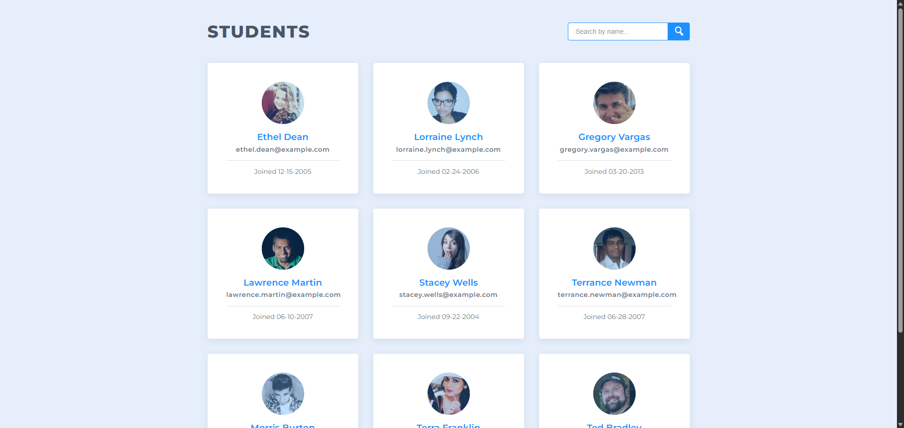

📚 Data Pagination & Filtering

Treehouse Full Stack JavaScript Techdegree – Unit 02

This project displays a list of students with pagination and dynamic filtering.
It focuses on DOM manipulation, event handling, and working with arrays of objects to build an interactive and user-friendly interface using vanilla JavaScript.

🔗 Live : https://fullstackmachina.github.io/unit02_data_pagination_and_filtering/

📸 Preview

🎯 Project Requirements

- Create a showPage function to render student cards on the page
- Create an addPagination function to render pagination buttons
- Create a click handler to update the active page

⭐ Extra Credit Features

- Add a search component
- Add a search functionality
- Add pagination for  search results
- Handle cases where no results are found

🧪 Testing & Quality Assurance

- Tested pagination across all pages
- Verified search functionality with:
    * partial matches
    * uppercase/lowercase input
    * empty results
- Monitored Chrome DevTools console for errors
- Ensured consistent indentation and clean code structure
- Replaced starter comments with meaningful explanations

🧠 What I Learned in this unit 

- How JavaScript works with the DOM
- DOM manipulation and scripting
- Debugging JavaScript in the browser
- Plan with pseudocode
- Writing reusable and maintainable functions

🛠️ Tech Stack

- JavaScript (ES6)
- HTML5
- CSS3

🔮 Possible Improvements

- Highlight matching text in search results
- Add keyboard navigation for pagination
- Improve accessibility (ARIA labels, focus states)
- Add animations when changing pages
